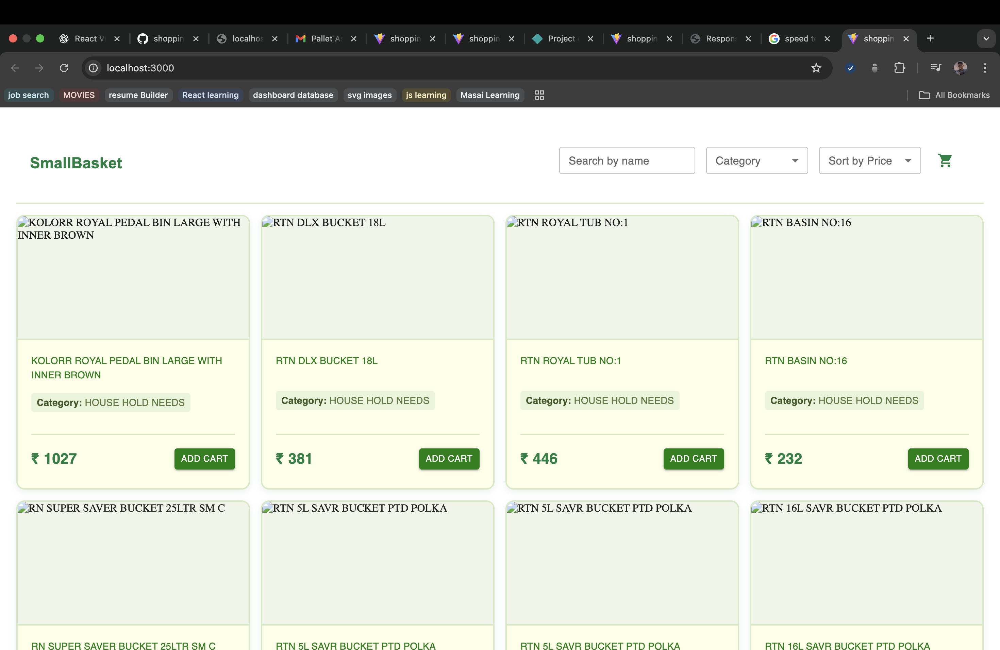

# 🛒 SmallBasket – Product Table Dashboard

[](https://reactjs.org/)
[](https://mui.com/)
[](https://zustand-demo.pmnd.rs/)
[](https://opensource.org/licenses/MIT)

A **responsive e-commerce product dashboard** built with React, Material-UI (MUI), and Zustand. Users can browse products, search, filter, sort, view details, and manage a shopping cart.

---

## 🌟 Features

- **Product Listing:** Responsive grid layout of products.
- **Search:** Real-time search by product name.
- **Filter:** Filter products by category.
- **Sort:** Sort products by price (ascending/descending).
- **Product Details:** Click a product to view detailed info.
- **Add to Cart:** Add products to a shopping cart with snackbar alert.
- **Responsive Design:** Mobile-friendly with a drawer for filters.
- **Pagination:** Navigate through multiple pages of products.
- **Skeleton Loading:** Placeholder UI while fetching data.

---

## 🛠️ Tech Stack

- **Frontend:** React.js
- **UI Library:** Material-UI (MUI)
- **State Management:** Zustand
- **Routing:** React Router DOM
- **Styling:** MUI `sx` prop + custom styled components

---

## 📂 Folder Structure

```plaintext
src/
├── components/
│   ├── Navbar.jsx
│   ├── FilterDrawer.jsx
│   ├── ProductCard.jsx
│   ├── ProductGrid.jsx
│   ├── ProductFilters.jsx
│   └── SnackbarAlert.jsx
├── pages/
│   └── ProductTable.jsx
├── store/
│   ├── useProductStore.js
│   └── useCartStore.js
├── styles/
│   └── ProductTable.styles.js
└── App.jsx


---

## 📷 Screenshots

**Product Grid**


**Product Card Hover**


**Mobile Filter Drawer**


---

## 🚀 Getting Started

1. **Clone the Repository**

git clone https://github.com/<your-username>/smallbasket.git
cd smallbasket


Install Dependencies
npm install

--- 

Run Development Server
npm run dev

---

Open your browser at http://localhost:3000
 to see the app.

🔗 Live Demo : https://subtle-pavlova-18edaf.netlify.app/

⚡ Usage

Search Products: Use the search bar to filter products by name.

Filter by Category: Select a category from the dropdown.

Sort Products: Sort products by price (Low to High / High to Low).

Add to Cart: Click “Add Cart” button on any product card.

Mobile Filters: Tap the menu icon on mobile to open the filter drawer.

Pagination: Use pagination controls to navigate between pages.

---

📦 Components Overview

Component	Description
Navbar	Responsive top navigation with logo and desktop filters.
ProductFilters	Search, category filter, and sort dropdowns.
FilterDrawer	Drawer component for mobile filters.
ProductGrid	Grid layout of product cards with skeleton loading.
ProductCard	Displays product image, name, category, price, and Add to Cart button.
SnackbarAlert	Visual alert when product is added to cart.
